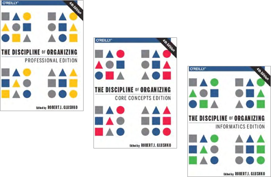

---
layout:
  title:
    visible: true
  description:
    visible: false
  tableOfContents:
    visible: true
  outline:
    visible: true
  pagination:
    visible: true
---

# TL;DR » PRESENTACIÓN DE LA EDICIÓN “LITE” EN ESPAÑOL

_**Organización y descripción de recursos de información digital**_ es el título por el que finalmente nos hemos decidido para la traducción al español de tres de los capítulos del manual de referencia de la red internacional de iSchools **The discipline of organizing**, en el que se aborda el marco genérico de los sistemas de organización aplicables especialmente sobre objetos informativos digitales. Se trata de una obra que presenta de forma integrada los aspectos conceptuales que subyacen en diferentes campos –representación del conocimiento, bibliotecas, archivos, museos, publicación digital, recuperación de información, gestión de contenidos, diseño de servicios de información digitales– y que explican los fundamentos compartidos del continuo reto social de organizar información para permitir su acceso, enriquecimiento, almacenamiento y descubrimiento. La obra, coordinada por Robert J. Glushko, ha ido incorporando progresivamente los enfoques de áreas en auge, como la ciencia de datos, el posicionamiento web o la web de datos, creando un manual que propone un utillaje léxico compartido que enlaza desde ámbitos clásicos como la biblioteconomía y documentación hasta el de la gestión corporativa de activos de información, la gestión de datos públicos abiertos, pasando por las ingenierías de la información y las ciencias cognitivas.

<figure><figcaption>
<em><strong>The discipline of organizing</strong></em>
</figcaption></figure>

El libro que extractamos y traducimos es una obra ambiciosa. La primera edición de 2013 del libro _**The discipline of organizing**_, conocido como **TDO book**, fue reconocida por ASIS\&T (_Association for Information Science and Technology_) como el libro del año en el campo de _information science_. Ha sido reeditado en sellos editoriales de referencia en el campo de la información digital, como O’Reilly y el MIT o la Universidad de Berkeley, y va ya por su cuarta edición, en su voluntad de no perder el paso a los acelerados cambios de tendencia en organización del conocimiento y explotación de información digital. Además, está concebido de una forma atrevida: existe una versión profesional, donde cada cita se enmarca en un área (Ciencias cognitivas, informática, LIS), junto a otra edición para lectores del área de la “informática”, junto a la denominada edición core concepts, que reduce el aparato bibliográfico y busca una lectura más directa, que es la que tomamos como punto de partida en esta traducción.&#x20;

¿Qué es “la disciplina de la organización”? Si bien está claro el sentido del título de la obra, en su traducción hemos optado por desviarnos de la literalidad del término “disciplina”, y preferido el de “campo”, con resonancias a campo profesional, a conjunto de técnicas aplicadas sobre un mismo objeto, y frente a la ambivalencia de “organización” como entidad y como actividad, hemos preferido usar la forma verbal de “organizar”. En español podríamos explorar un título como el de “Organizar información: un campo abierto”. Dado que además esta edición representa solo unos pocos aspectos del libro completo, añadir el concepto de “descripción de recursos de información” ayuda a delimitar su alcance y, por otro lado, darle relevancia al objeto de la “información digital”, el cual nos gustaría que se leyera como “contenidos digitales”. La información digital no es una abstracción útil, necesita existir materializada en contenidos con una alta dosis de inteligencia incorporada: contenidos que expresan sus significados, relaciones y estructura de forma clara al resto de actores del medio digital. El contenido digital precisa ser “ingenierizado” con precisión para funcionar con fluidez en la red; es un contenido con una intensa carga de diseño que suponen decisiones tecnológicas dependientes del contexto, de estándares, plataformas y servicios de mediación, que lo enriquecen y multiplican sus prestaciones.

Los autores usan el término “Sistemas de organización” como un continuo histórico y como un enfoque compartido en diferentes dominios:&#x20;

* “La elaboración de conceptos, métodos y tecnologías para describir y organizar los recursos ha sido una actividad humana esencial durante milenios, que ha evolucionado tanto en respuesta 9 Organización y descripción de recursos de información digital a las necesidades humanas como para permitir otras nuevas. Los Sistemas de Organización permitieron el desarrollo de la civilización, desde la agricultura y el comercio hasta el gobierno y la guerra. Hoy en día, los Sistemas de Organización están incorporados en todos los ámbitos de la actividad económica, incluida la investigación, la educación, el derecho, la medicina, los negocios, la ciencia, la memoria institucional, la memoria sociocultural, el gobierno, la rendición de cuentas, así como en los actos ordinarios de la vida cotidiana.”

Las diferentes formas en que la organización de información se hace presente en nuestra sociedad digitalizada tiende a hacerse invisible. La información es ubicua y va pegada a casi cualquier interacción, y, por ello, se da por descontada o se naturaliza, como si fuera un resultado espontáneo de los procesos. Millones de personas crean y navegan sitios web, hacen blogs, etiquetan, twittean y cargan y descargan contenidos de todo tipo de medios sin pensar “estoy organizando información” o “estoy recopilando datos”. En el fondo generan productos dotados de una arquitectura de la información Para los autores del libro una de las ideas centrales es que la distinción entre la organización de la información y la recuperación de la información que suele manifestarse en las disciplinas académicas y los planes de estudio es mucho menos importante de lo que era antes. El “TDO book”, por tanto

* “tiene pocas divisiones marcadas entre los temas de organización de la información (IO) y de recuperación en formación (IR). En cambio, explica los conceptos clave y los desafíos en el diseño y el despliegue de los sistemas de organización de manera que enfatiza continuamente las relaciones y las compensaciones entre IO e IR. El concepto de Sistema de Organización destaca las dimensiones y las decisiones de diseño que determinan colectivamente el alcance y la naturaleza de la organización de los recursos y las capacidades de los procesos que comparan, combinan, transforman e interactúan con los recursos organizados.”

La disponibilidad en español de esta obra puede ayudar a mejorar la formación en organización de información, que es un elemento constitutivo de diversos estudios universitarios y campos de especialización académica y profesional, que proceden de tradiciones separadas. Esta traducción es parcial, puesto que se opta por abrir un camino en las abundantes lagunas en traducciones de manuales actualizados y reputados vinculados a la información digital. El libro TDO es una obra extensa – y por ello sugerente, potente e integradora – pero hemos preferido mostrar resultados tangibles en un plazo corto.

Hemos elegido tres capítulos que delimitan inicialmente los conceptos esenciales para entender transversalmente la disciplina de organizar cualquier tipo de recurso, construyendo una abstracción para los Sistemas de Organización que sea independiente de dominios de aplicación clásicos, en donde se proponen una serie de componentes, y en el que tienen especial importancia las actividades de descripción y representación de objetos que son, esencialmente, contenidos informativos, en donde se diferencia entre recursos primarios y recursos derivados o metadatos. La delimitación del resbaladizo concepto de recurso de información, simple, agregado, dinámico, multiforme, como objeto tangible sobre el que desarrollar las tareas de organización, ocupa otro de los capítulos que hemos recogido. La descripción de recursos pretende responder a las cuestiones complejas de identificar, denominar y enriquecer la información que hace a un recurso valioso dentro de una colección, lo conecta con otros en función de su contenido informativo y permite contextualizarlo como objeto social para la producción de valor y conocimiento.

Estos tres capítulos esperamos que sirvan de estímulo para próximas ediciones ampliadas, en la que se combinen los recursos e intereses de diferentes entidades vinculadas al sector de la información digital, los servicios de información, el patrimonio cultural y la formación especializada. La edición completa del libro, disponible en acceso abierto para su descarga completa y por capítulos en la web de la red de iSchools, se estructura en 12 capítulos, conforme al siguiente esquema:

### FUNDAMENTOS DE LOS SISTEMAS DE ORGANIZACIÓN

Este capítulo inicial corresponde con el capítulo 1 de la traducción incluida en esta primera edición parcial en español, en el que se enmarca la actividad de organización información y se definen sus componentes esenciales.

### DECISIONES DE DISEÑO EN SISTEMAS DE ORGANIZACIÓN

Se abordan seis cuestiones o dimensiones de amplio alcance que se entrelazan al definir un Sistema de Organización. Qué se organiza, por qué se organiza, cuánto se organiza, cuándo se organiza, cómo se organiza y dónde se organiza. Este marco para describir y comparar sistemas de organización permite entender desde patrones generales de diseño los sistemas usados en bibliotecas, archivos y museos, y generalizar, evitando así sus sesgos anclados en sus tradiciones específicas. Estos patrones pueden dar soporte a la colaboración 11 Organización y descripción de recursos de información digital interdisciplinar, facilitando que se apliquen categorías y conocimientos de campos más afines en otros más lejanos del discurso sobre organización de recursos de información.

### LAS ACTIVIDADES EN LOS SISTEMAS DE ORGANIZACIÓN

Para tener una visión que reúna la forma en que organizamos cosas individualmente con la forma en la que lo hacemos desde bibliotecas, museos, administraciones, centros de investigación y empresas para crear Sistemas de Organización, requiere plantear unas generalizaciones de los conceptos y métodos de la organización tomados de cada uno de estos dominios. A partir de la revisión de una amplia variedad de Sistemas de Organización, se describen cuatro actividades y funciones que comparten todos ellos: seleccionar recursos, organizar recursos, diseñar interacciones y servicios basados en los recursos y mantener esos recursos a lo largo del tiempo.

### LOS RECURSOS EN LA ORGANIZACIÓN DE SISTEMAS

Este capítulo corresponde al segundo capítulo incluido en esta traducción, y aborda la pregunta ¿Qué es lo que se organiza en un Sistema de Organización? Se desarrolla el concepto de recurso, que supone una generalización de los diferentes tipos de contenidos que pueden integrarse en un sistema, tanto si son objetos físicos como digitales, estáticos o dinámicos. Se presentan en detalle las complejidades inherentes a identificar y delimitar recursos, dado que son aspectos que influyen en la capacidad de un sistema para dar soporte adecuado a las interacciones establecidas en su diseño.

### DESCRIPCIÓN DE RECURSOS Y METADATOS

Incorporado en este libro como capítulo 3, se abordan los principios por los que se organizan recursos y el tipo de interacciones que se podrán habilitar según las opciones de descripción asumidas explícitamente. El asunto central de la profundidad y extensión de la descripción se presentan en el marco de un proceso genérico para diseñar y realizar la descripción, combinando la intervención humana directa y los procesos automatizados.

### DESCRIPCIÓN DE RELACIONES Y ESTRUCTURAS

Un aspecto clave de la organización de colecciones de recursos es describir las relaciones que se establecen entre ellos. Se introduce un vocabulario específico para representar relaciones semánticas tanto entre recursos entre sí, como entre recursos y los conceptos y términos usados en recursos descriptivos. También se debate sobre las relaciones estructurales en los recursos compuestos de partes, y las relaciones entre recursos y los recursos que se citan y con los que se establecen enlaces hipertextuales.

### CATEGORIZACIÓN: DESCRIPCIÓN DE TIPOS Y CLASES

Agrupaciones o conjuntos de recursos con descripciones similares o idénticas pueden tratarse como equivalentes, haciéndolos formar parte de una clase o categoría. Identificar y usar categorías es una de las actividades humanas esenciales que sucede automáticamente para las categorías perceptivas, tales como “cosas rojas” o “cosas redondas”. La categorización está profundamente integrada en el lenguaje y la cutura, y usamos categorías lingüísticas y culturales sin apenas darnos cuenta, aunque la categorización también puede ser un proceso cognitivo analítico muy profundo. En este capítulo se repasan las teorías de la categorización desde el punto de vista de cómo se usan y crean en los Sistemas de Organización.

### CLASIFICACIÓN: ASIGNACIÓN DE RECURSOS A CATEGORÍAS

A menudo se usa indistintamente categorización y clasificación, pero no se trata de lo mismo. La clasificación la entendemos como categorización aplicada – la asignación a los recursos dentro de un sistema de categorías, llamadas clases, usando una serie predeterminada de principios. Este capítulo debate el amplio abanico de formas en que las clasificaciones se usan en Sistemas de Organización. Se tratan las clasificaciones enumerativas, facetadas, basadas en actividades y la clasificación computacional. Dado que la clasificación y la normalización están estrechamente relacionadas, también se analizan los estándares existentes y cómo se construyen como parte de los Sistemas de Organización.

### FORMATOS DE LA DESCRIPCIÓN DE RECURSOS

Este capítulo complementa la perspectiva conceptual y metodológica de la creación de descripciones de recursos con la perspectiva de la implementación. Se revisan varios metamodelos para estructurar las descripciones, con particular énfasis en XML, JSON y RDF. Se cierra con la comparación entre los “mundos de la descripción” – procesamiento de documentos, la web y la web semántica— en los cada uno de estos tres metamodelos encajan mejor.

### LA INTERACCIÓN CON LOS RECURSOS

Cuando varios Sistemas de Organización se solapan, intersectan o combinan, bien sea temporal o permanentemente, las diferencias en la descripción de los recursos puede hacer que resulte difícil o imposible localizarlos, accederlos o se impida usarlos. En este capítulo se revisan algunos conceptos y técnicas que desde diferentes dominios se aplican cuando se interactúa con recursos en Sistemas de Organización – integración, interoperabilidad, mapeo de datos, crosswalks, mash-ups, etc. Las interacciones se caracterizan por las capas de propiedades de los recursos que usan: instancias, colecciones, derivados o propiedades combinadas desde diferentes fuentes. Se desarrolla la idea de que un continuo entre organización de información y recuperación de información, y se describen las interacciones de recuperación de información (y otras) en términos de requisitos de organización de información (es decir, descripciones).

### HOJA DE RUTA PARA SISTEMAS DE ORGANIZACIÓN

En este capítulo se complementa la perspectiva descriptiva expuesta en los capítulos 2 a 10, con un enfoque más prescriptivo que analiza las opciones de diseño y decisiones entre opciones enfrentadas (tradeoffs) que deben hacerse en las diferentes fases del ciclo de vida de un Sistema de Organización. Los modelos de ciclo de vida de sistemas presentan una gran variedad, pero optaremos por un modelo género en cuatro fases que diferencia la fase de identificación del dominio y alcance, la fase de requisitos, una fase de toma de requisitos y diseño, y una fase operacional.

### ESTUDIOS DE CASO

Este último capítulo parte del modelo presentado en el capítulo previo para orientar el análisis de estudios de caso que expanden el alcance de los Sistemas de Organización, cuando se interpretan desde los principios, pautas, términos y modelos expuestos a lo largo del libro.

***

Finalizamos la presentación de esta obra recordando el principio formulado por Elaine Svenonius de que **“la efectividad de un sistema de acceso a la información es una función directa de la inteligencia puesta en organizarlo”**. Cuando observamos desde una perspectiva amplia los fenómenos involucrados en la información en sociedad, podemos constatar que una vez que es puesto en movimiento un flujo de información, implica una importante cantidad de recursos y agentes, para su producción, para conseguir un impacto de difusión suficiente, y para mantenerse accesible a lo largo del tiempo. El ciclo de vida de la información supone también grandes ineficiencias, suplidas para ciertos usos hoy en día por monstruosos sistemas de procesamiento de contenidos a gran escala. La falta de una mejor “inteligencia incorporada”, es decir, metadatos y estructuras de información óptimas para los ecosistemas y plataformas digitales, supone un coste social, materializado en sobrecostes, escasez de acceso intelectual al contenido de recursos de información publicados, perduración de restricciones técnicas evitables, infrautilización de recursos y todo tipo de ineficiencias que sugieren la importancia de entender la organización de información como un pegamento para aportar valor tanto a la industria de los contenidos, el negocio digital, la difusión de la cultura y los recursos educativos a todos los niveles. El reto colectivo de que la información sea fuente de valor para sociedades complejas y el conocimiento un recurso distribuido con equidad y sostenibilidad afecta a muchas disciplinas académicas, perfiles profesionales tradicionales y de nuevo cuño, y actores políticos e institucionales. Tender puentes entre dominios creando un lenguaje común que permita trabajar juntos a las ingenierías tecnológicas, las ciencias métricas, las ciencias sociales y las ciencias humanas, es el objetivo de este libro cuando sea leído y puesto en práctica por aquellos actores de la sociedad de la información que están interviniendo en que todo tipo de actividades de información multipliquen sus efectos para generar conocimientos, conexiones y sentido.

#### Febrero, 2021

<table data-view="cards"><thead><tr><th></th><th></th><th></th></tr></thead><tbody><tr><td>Tomás Saorín</td><td><em>Grado en Gestión de información y Contenidos Digitales</em></td><td>Universidad de Murcia</td></tr><tr><td>Eva Méndez</td><td><em>Grado en Gestión de información y Contenidos Digitales</em></td><td>Universidad Carlos III</td></tr><tr><td>Mario Pérez-Montoro</td><td><em>Grado en Gestión de Información y Documentación Digital</em></td><td>Universidad de Barcelona</td></tr></tbody></table>
