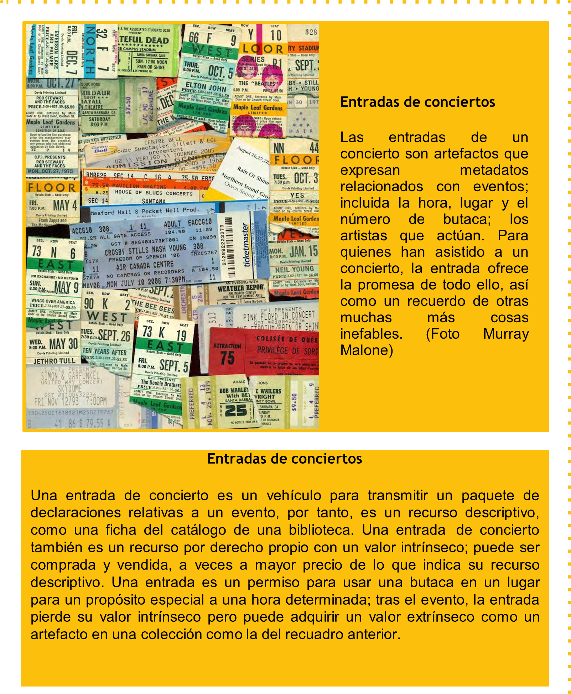

---
layout:
  title:
    visible: true
  description:
    visible: false
  tableOfContents:
    visible: true
  outline:
    visible: true
  pagination:
    visible: true
---

# 1.3 El concepto de “Recurso”

El significado más extendido del término “Recurso” es el de cualquier cosa de valor que pueda apoyar una actividad orientada a un objetivo. Esta definición significa que un recurso puede ser una cosa física, una cosa no física, información sobre cosas físicas, información sobre cosas no físicas, o cualquier cosa que se quiera organizar. Otras palabras que pretenden englobar lo mismo son “entidad”, “objeto”, “artículo” o “instancia”. La palabra “documento” se utiliza a menudo para un recurso de información en formato digital o físico; “artefacto” se refiere a recursos creados por personas, y “activo” a recursos con valor económico.

“Recurso” tiene un significado especializado en la arquitectura de Internet. Es habitual describir las páginas web, las imágenes, los vídeos, etc. como recursos, y el protocolo para acceder a ellos, el Protocolo de Transferencia de Hipertexto (HTTP), utiliza el Identificador Uniforme de Recursos (URI).

Tratar como un **recurso primario cualquier cosa que pueda ser identificada** supone una generalización importante del concepto porque permite que los servicios basados en la web, las fuentes de datos, los objetos con etiquetas RFID, los sensores u otros dispositivos inteligentes, o los agentes computacionales puedan formar parte de sistemas de organización.

En lugar de enfatizar las diferencias entre los recursos tangibles e intangibles, consideramos que es esencial **determinar si el contenido**

<figure><figcaption>
Entradas de conciertos
</figcaption></figure>

**del recurso tangible es información** (si se necesita entender y procesar de lo que trata o si representa o se refiere a algún recurso de otro tipo, en lugar de ser tratado como una cosa en sí misma). Tanto en un libro impreso como digital, nos fijamos en su contenido informativo, de qué trata; sus propiedades tangibles pasan a ser secundarias. Por el contrario, en el caso de las perchas del armario y las jarras de cocina que usamos para medir cantidades no son más que sus obvias características utilitarias las que hacen que sus propiedades tangibles sean más importantes. (Por supuesto, no hay un límite claro aquí; puedes comprar “las perchas de moda” como un artículo de decoración, y la vieja jarra de medir podría ser un recuerdo familiar porque perteneció a tu abuela).

Muchos de los recursos de los Sistemas de Organización son **recursos descriptivos o recursos sustitutivos** que describen los recursos primarios; las entradas del catálogo de una biblioteca o la lista de resultados de búsqueda en la web son ejemplos conocidos. En los museos, la información sobre la producción, la cobertura o la historia de la propiedad de un recurso puede ser más importante que el propio recurso en sí; unos pocos fragmentos de cerámica tienen poco valor sin estos recursos de información asociados. Del mismo modo, los datos comerciales o científicos a menudo no pueden ser subestimados o analizados sin información adicional sobre la manera en que fueron recopilados. La mayoría de las empresas basadas en la web explotan los datos sobre la forma en que los usuarios interactúan con los recursos, como los archivos de log que registran cada búsqueda en la web, cada enlace en el que se hace clic y cada página web que se visita.

**Los recursos que describen, o que están asociados con otros recursos, se denominan a veces “metadatos”.** Sin embargo, cuando se examinan más ampliamente los Sistemas de Organización, suele ser difícil distinguir entre el recurso que se describe y cualquier descripción del mismo o asociada a él. Cuando las descripciones se incorporan a los recursos, como con frecuencia sucede con los metadatos (en la portada de un libro, en la cabecera de un periódico o en el código fuente de las páginas web), decidir qué recursos consideramos primarios es un desafío de diseño y suele tener algo de arbitrario.

También se nos presenta otro reto cuando lo que sirve como metadatos para una persona o proceso puede funcionar como un recurso primario o como datos para otra. En lugar de ser una distinción inherente, la diferencia entre los recursos primarios y los asociados suele ser sólo una decisión sobre en qué recurso nos estamos centrando en una determinada situación. Un espécimen de animal en un museo de historia natural puede ser un recurso primario para los visitantes del museo y los científicos interesados en la anatomía, pero la información sobre el lugar donde se recogió el espécimen es el recurso primario para los investigadores interesados en la ecología o la migración.

Los Sistemas de Organización pueden referirse a las personas como recursos y a menudo utilizamos ese término para evitar especificar el género o el papel específico de un empleado o trabajador, dentro del ámbito de gestión del departamento de “recursos humanos” en un entorno laboral. [Una empresa se define por su disposición intencional de recursos humanos, y hay tanto variedad como regularidad en estas disposiciones.](#user-content-fn-1)[^1]

Los recursos humanos en los Sistemas de Organización pueden entenderse de manera muy parecida a los recursos físicos o digitales inanimados: se seleccionan, se organizan y se gestionan, y pueden crear valor individualmente o mediante sus interacciones con otros dentro y fuera del sistema. Sin embargo, [los seres humanos son recursos singularmente complicados, y cualquier Sistema de Organización que los utilice debe tener en cuenta sus derechos, motivaciones y relaciones.](#user-content-fn-2)[^2]

[^1]: Puede consultarse el recuadro complementario “Business Structures” en el apartado §6.5 del capítulo 6 “The Structural Perspective”, de libro “TDO core concepts edition.”

[^2]: Véase el recuadro complementario “Las personas como recursos”, en el apartado §2.2.3. del capítulo 2 “Los recursos en los Sistemas de Organización”, en este mismo libro.
