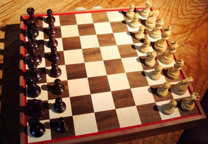

---
layout:
  title:
    visible: true
  description:
    visible: false
  tableOfContents:
    visible: true
  outline:
    visible: true
  pagination:
    visible: true
---

# 2.1.1.1. Los recursos compuestos por partes

Por muy difícil que sea decidir qué es un recurso cuando se trata de objetos individuales, es aún más difícil cuando los recursos son objetos o sistemas compuestos por otras partes. En estos casos, debemos centrarnos en la totalidad del objeto o sistema y tratarlo como un recurso, tratar sus partes como recursos y tratar las relaciones entre las partes y el todo, como lo hacemos con los dibujos de ingeniería y las instrucciones de montaje.

¿Cuántas cosas componen un coche? Si intentas imaginar cómo se ensambla un coche, podrías pensar en varias docenas de componentes grandes como el bastidor, la suspensión, la cadena de tracción, el depósito de gasolina, los frenos, el motor, el tubo de escape, el compartimento de los pasajeros, las puertas y otros componentes preensamblados. Por supuesto, cada uno de ellos está compuesto de muchas partes, como el motor o, incluso, la radio. Hay quienes se han dedicado a la ardua tarea de contar hasta diez o quince mil partes que componen, de media, un coche. Pero, incluso con tal grado de precisión, muchas partes siguen siendo cosas compuestas de otras. Hay tornillos, cables, cinturones y mucho más; en realidad, son demasiadas para contarlas.

La ambigüedad sobre el número de partes del conjunto se mantiene también para los recursos informativos; un periódico puede ser considerado como un único recurso, pero también puede constar de múltiples secciones, cada una de las cuales contiene historias separadas, cada una de las cuales tiene a su vez muchos párrafos y así sucesivamente. De la misma manera, si bien una página web puede tratarse como un único recurso, también puede considerarse como una colección de partes más granulares, cada una de las cuales puede identificarse por separado como el código fuente o el texto de ancla de un enlace. Asimismo, cuando un cliente solicita en el banco una tarjeta de crédito, se puede recabar información acerca de los préstamos pendientes, el historial de pagos, los ingresos actuales y otro tipo de información, o el banco puede simplemente acceder a la puntuación crediticia, el indicador agregado que combina todos estos datos financieros en un solo número.

<figure><figcaption>
¿Cuántos componentes definen el juego del ajedrez?
</figcaption></figure>


#### ¿Cuántos componentes definen el juego del ajedrez?

El juego del ajedrez ejemplifica las diferentes maneras de decidir qué considerar como único recurso. ¿Lo podemos considerar como dos juegos de piezas de ajedrez? ¿seis tipos de piezas de ajedrez (1 rey, 1 reina, 2 torres, 2 alfiles, 2 caballeros, 8 peones)? ¿33 cosas separadas (las 32 piezas y el tablero)?

(Fotografía de Emma Jane Hogbin Westby).&#x20;

Licencia de Creative Commons CC-BY-2.0

