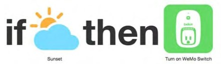

---
layout:
  title:
    visible: true
  description:
    visible: false
  tableOfContents:
    visible: true
  outline:
    visible: true
  pagination:
    visible: true
---

# 2.2.3.2. Recursos activos, o recursos operantes

Los recursos activos crean efectos o valor por sí mismos, a veces cuando interactúan con los recursos pasivos. Los recursos activos pueden ser personas, otros recursos vivos, agentes informáticos, fuentes activas de información, servicios basados en la web, coches que se conducen solos, robots, aparatos, máquinas u otros objetos ordinarios como bombillas, paraguas y zapatos que se han hecho “más inteligentes”. Podemos explotar la capacidad de computación, la capacidad de almacenamiento y el ancho de banda de comunicaciones para crear recursos activos que puedan hacer cosas y apoyar interacciones que son imposibles para los recursos pasivos físicos ordinarios.

Podemos analizar los recursos activos de acuerdo con cinco capacidades que aumentan progresivamente su “agencia”: sensibilidad, activación, conectividad, programabilidad, componibilidad. Estas capacidades se complementan entre sí para dar a los recursos y a los Sistemas de Organización en los que participan más formas de crear valor a través de interacciones e intercambios de información.

#### SENSIBILIDAD (AWARENESS)

* La capacidad mínima para que un recurso tenga un cierto grado de agencia es que sea capaz de percibir o ser consciente de algún aspecto de su entorno o de sus interacciones con otros recursos. Un termómetro mide la temperatura, un fotodetector mide la luz, un medidor mide el combustible que queda en el depósito de gasolina de un coche, un dispositivo GPS calcula su ubicación después de detectar y analizar las señales de los satélites, un sensor _wearable_ de parámetros físicos rastrea los latidos del corazón y la distancia que se camina. Pero captar algo del entorno, en sí mismo, no crea ningún valor en un Sistema de Organización: es necesario que además haga algo.

#### ACTIVACIÓN (ACTUATION)

* Un recurso tiene la capacidad de activación cuando puede crear efectos o valor iniciando alguna acción como resultado de la información que percibe; “activador” (actuator) se utiliza a menudo para describir un recurso que puede mover o controlar un mecanismo o sistema físico, mientras que “efector” se utiliza cuando el recurso es biológico. Los recursos pueden actuar encendiendo luces, altavoces, cámaras, motores, interruptores, enviando un mensaje sobre el estado o el valor de un sensor, o moviéndose por sí mismos (como en el caso de los robots).

Se crea una actuación potencial o latente cuando un recurso puede mostrar o emitir algún aspecto de su estado, pero sólo se crea valor si otra fuente (posiblemente humana) ve la pantalla o escucha la emisión y luego actúa sobre ella.

Por ejemplo, los chips de RFID, que son esencialmente códigos de barras con transpondedores de radio incorporados, pueden ser adjuntados a recursos que de otra manera serían pasivos para hacerlos activos. Los chips de RFID comienzan a transmitir cuando detectan la presencia de un dispositivo de lectura de RFID. Esto permite el seguimiento automatizado de la ubicación y la detección del contexto. Los receptores de RFID están incorporados en líneas de montaje, muelles de carga, aparcamientos, cabinas de peaje o estanterías de tiendas para detectar cuando algún recurso marcado con RFID se encuentra en algún lugar significativo. Las etiquetas RFID pueden ser más útiles si además se les hace registrar y transmitir la información de los sensores que detectan la temperatura, la humedad, la aceleración, e incluso la contaminación biológica.

#### CONECTIVIDAD (CONNECTIVITY)

* Para que un recurso activo realice un trabajo útil debe estar conectado de alguna manera a un mecanismo de actuación que manipula o controla algun otro recurso. Esta conexión puede ser directa y permanente entre el recurso y la cosa que acciona, como la de un termostato cuya capacidad de detección de temperatura tiene una conexión fija con un sistema de calefacción o refrigeración que apaga o enciende dependiendo de la temperatura.
* Una innovación importante en el diseño de los recursos activos es “envolver” los recursos físicos con software para que se les pueda dar direcciones IP y hacer conexiones con protocolos de Internet, lo que les permite enviar información a una aplicación externa con mayores capacidades de actuación. Se dice que esos recursos forman parte de la “Internet de las cosas”.
* Los teléfonos inteligentes son recursos activos que pueden identificar y compartir su propia ubicación, orientación, aceleración y un número creciente de otros parámetros contextuales para permitir la personalización de los servicios de información. Los teléfonos inteligentes también pueden ejecutar aplicaciones que reciben y envían mensajes a otros recursos inteligentes para supervisar y optimizar su funcionamiento.

#### COMPUTABILIDAD O PROGRAMABILIDAD (COMPUTATION OR PROGRAMMABILITY)

* Los recursos activos simples operan de manera determinista: dada la lectura del sensor, haz esto. Otros recursos activos tienen capacidades computacionales que les permiten analizar la información actual e histórica de sus sensores, identificar valores o patrones de datos significativos en estos recursos de interacción, y luego adaptar su comportamiento.
* Muchos termostatos son programables, pero la mayoría de las personas no se molestan en programarlos, por lo que pierden el potencial de ahorro de energía. Nest Labs fabrica un termostato de aprendizaje que se programa a sí mismo. El termostato Nest utiliza sensores de temperatura, humedad, movimiento y luz para saber si la gente está en casa, y una conexión Wi-fi para obtener datos meteorológicos locales.
* El robot aspirador Roomba navega alrededor de los muebles, cables de alimentación, escaleras, y optimiza sus rutas de limpieza para pasar por lugares particularmente sucios. Pero aspirar es todo lo que hace. Los robots más sofisticados están diseñados para ser versátiles y adaptables, de modo que pueden realizar repetidamente cualquier tarea necesaria en un proceso de fabricación y sus capacidades pueden actualizarse continuamente mediante actualizaciones de software, al igual que las aplicaciones de su teléfono inteligente. Una nueva generación de robots “tipo Baxter” (nombre tomado de uno de sus modelos) puede ser entrenada a través de observar un ejemplo; una persona mueve los brazos y las manos de Baxter para mostrarle lo que debe hacer, y cuando Baxter se ha programado para repetirlo, asiente con la cabeza.

#### COMPONIBILIDAD Y COOPERATIVIDAD (COMPOSABILITY AND COOPERATION)

* Los recursos activos más “inteligentes” pueden hacer más que analizar la información que recogen y adaptar lo que hacen. Además, exponen a otros recursos lo que conocen y pueden activar a otros recursos, haciendo que hagan, utilizando protocolos y formatos estándar no-propietarios. Esto significa que los recursos activos que se diseñaron e implementaron de manera independiente pueden trabajar juntos para crear valor.
* Muchos Sistemas de Organización en la web consisten en colecciones o composiciones de recursos digitales activos. Las interacciones entre estos recursos activos a menudo implementan modelos de negocio que hacen uso intensivo de información, en los que el valor se crea mediante el intercambio, la manipulación, la transformación o el procesamiento de información, en lugar de la manipulación, la transformación o el procesamiento de recursos físicos.

Estamos empezando a ver los mismos principios de modularidad y compatibilidad aplicados a los recursos físicos, con bibliotecas de software de código abierto para el uso de sensores y microcontroladores y API fáciles de usar. En esencia, estamos utilizando el software y los recursos físicos a la manera de bloques de construcción funcionales y los estándares serán de vital importancia.

<figure><figcaption>
<strong>Recursos activos: El “ecosistema” del termostato Nest</strong>
</figcaption></figure>


#### Recursos activos: El “ecosistema” del termostato Nest

Estas dos capturas de pantalla de la aplicación del iPad Nest muestran el panel de control del termostato y un informe del historial de energía con una nota emergente que explica que el reajuste de la temperatura dio lugar a un uso de energía superior a la media en ese día. El termostato sirve como un dispositivo central, comunicándose con las luces, los electrodomésticos, las alarmas de humo, tu coche, tu ropa de deporte y otros recursos activos ([https://nest.com/works-with-nest/](https://nest.com/works-with-nest/)).

(Capturas de pantalla de Andrea Angquist. Usadas con permiso).


Los patrones de diseño para componer Sistemas de Organización a partir de recursos físicos “inteligentes” están progresivamente aplicándose para conseguir una “casa inteligente”, un “edificio de oficinas inteligente” o una “ciudad inteligente”. Se están realizando muchos experimentos y están surgiendo nuevos productos que están probando diferentes combinaciones de hardware y software para entender los equilibrios o compromisos de diseño entre los elementos implicados, para determinar mejor dónde deberían situarse los dispositivos “inteligentes”. Por ejemplo, podemos comparar una “casa inteligente” construida alrededor de un dispositivo central súper inteligente que se comunica y coordina con muchos otros dispositivos “no tan inteligentes” del mismo fabricante, con una en la que todos los dispositivos son igualmente inteligentes y provienen de diferentes fabricantes.

A escalas más complejas, un edificio verdaderamente inteligente no sólo tendrá termostatos programables para controlar los sistemas de calefacción y refrigeración. Tomará en cuenta los pronósticos meteorológicos, calendarios de viaje, información sobre el costo de la electricidad de diferentes fuentes y otra información relevante que será usada como input en un modelado informático de cómo el edificio se calienta y se enfría para optimizar el uso y el costo de la energía mientras se mantienen las habitaciones a temperaturas adecuadas.

Las interfaces de aplicación (APIs) estandarizadas permiten que los recursos activos interactúen con personas para obtener información que de otro modo podría provenir de los sensores o que aumenta el valor de la información de los sensores. Un termostato programable que puede registrar las preferencias temporales de las personas que utilizan el espacio controlado por el termostato es más capaz que uno con un solo umbral de temperatura. Un protocolo estándar de Internet para comunicarse con el termostato permitiría controlarlo a distancia.

Los formatos de datos y los protocolos de comunicación abiertos y normalizados permiten la agregación y el análisis de información de muchos casos del mismo tipo de recurso activo. Por ejemplo, los teléfonos inteligentes que funcionan con la aplicación Google Maps transmiten información sobre su velocidad y ubicación. El aprendizaje automático y sofisticadas técnicas de optimización de este conjunto de datos pueden dar lugar a una inteligencia colectiva que se puede devolver a los recursos de los que se ha obtenido. En este caso, Google puede identificar atascos y generar rutas alternativas para los conductores atascados en el tráfico.

Pero no todo se puede hacer mejor con los ordenadores. La web ha permitido el uso de personas como recursos activos para llevar a cabo tareas de corta duración que pueden ser descritas con precisión pero que no pueden ser realizadas de forma fiable por las computadoras. Estas tareas a menudo requieren de un juicio estético o subjetivo. Las personas que realizan estas tareas basadas en la web son a menudo llamadas “Turcos Mecánicos” (Mechanical Turks) por analogía con una falsa máquina de jugar al ajedrez del siglo XVIII que tenía un humano escondido en su interior que movía las piezas con destreza.

<figure><figcaption>
<strong>SI OCURRE ESTO, ENTONCES HAZ ESO</strong>
</figcaption></figure>


#### SI OCURRE ESTO, ENTONCES HAZ ESO

IFTTT (“If this, then that” en inglés) es un sistema de programación visual que permite a personas que no son programadoras conectar y controlar recursos activos en los mundos físico y digital. Los programas de IFTTT, llamados recetas, pueden coger información de una creciente variedad de servicios de Internet (fecha/hora, calendario, tiempo, noticias, correo electrónico, medios sociales y muchos otros) y usar esta información con una lógica sencilla de control para activar acciones en otros servicios o recursos. Las recetas de ejemplo pueden copiar una foto de Instagram a Google Drive, añadir datos de Fitbit diarios a una hoja de cálculo o controlar las luces en función de la hora, el tiempo o la puesta de sol.

“Si se pone el sol, enciende el enchufe.” El icono de la izquierda es el disparador; el icono de la derecha es la acción.

(Fotografía de R. Glushko)

