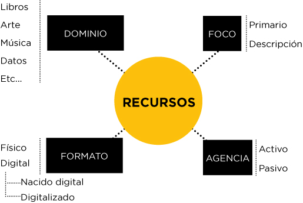

---
layout:
  title:
    visible: true
  description:
    visible: false
  tableOfContents:
    visible: true
  outline:
    visible: true
  pagination:
    visible: true
---

# 2.2. Cuatro distinciones sobre los recursos

La naturaleza de un recurso es fundamental para la creación y el mantenimiento de Sistemas de Organización de calidad. Hay cuatro distinciones que planteamos en relación con los recursos: el dominio, el formato, la agencia y el foco. En la imagen 2.1, Dominio, Formato, Foco y Agencia de los recursos, se representan estas cuatro distinciones, perspectivas o puntos de vista sobre los recursos; al no ser independientes, no podemos presentar estas distinciones como categorías de recursos.

<figure><figcaption>
<strong>Imagen 2.1. Dominio, formato, foco y agencia en los recursos</strong>
</figcaption></figure>


#### Imagen 2.1. Dominio, formato, foco y agencia en los recursos

Las cuatro distinciones que podemos hacer al hablar de los recursos se refieren a su dominio (su tipo de materia o contenido), su formato (físico o digital), su agencia (activa o pasiva) y su foco (primario o de descripción).

